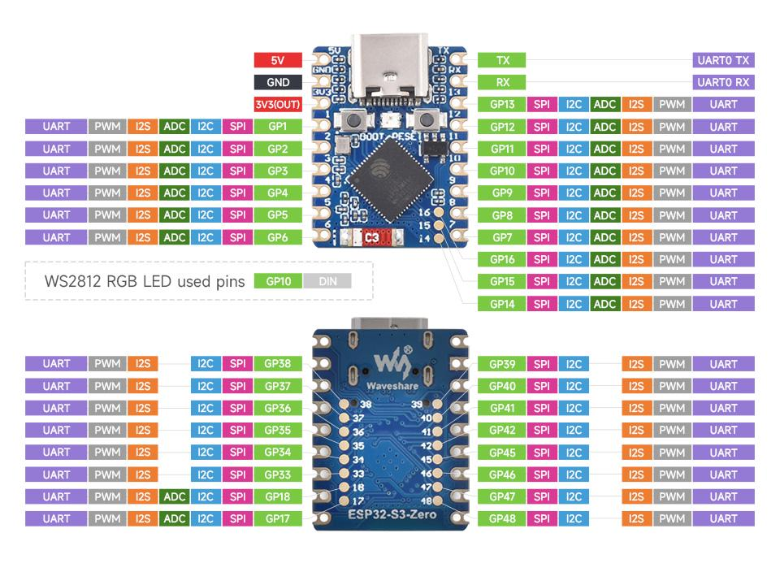
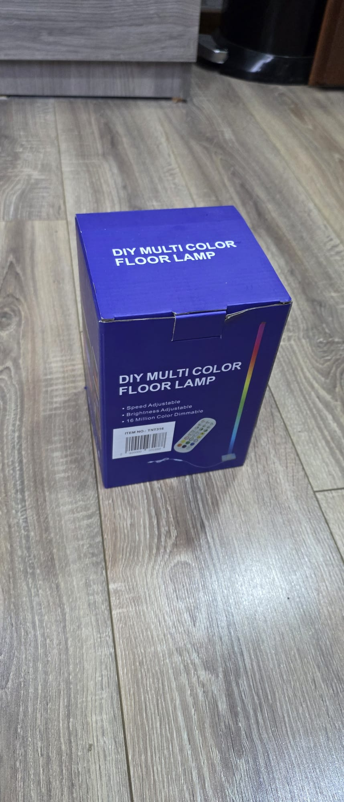
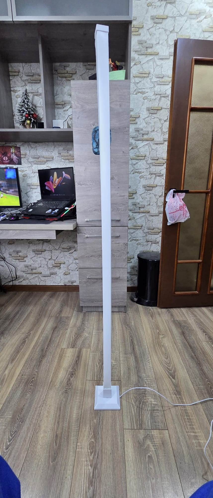
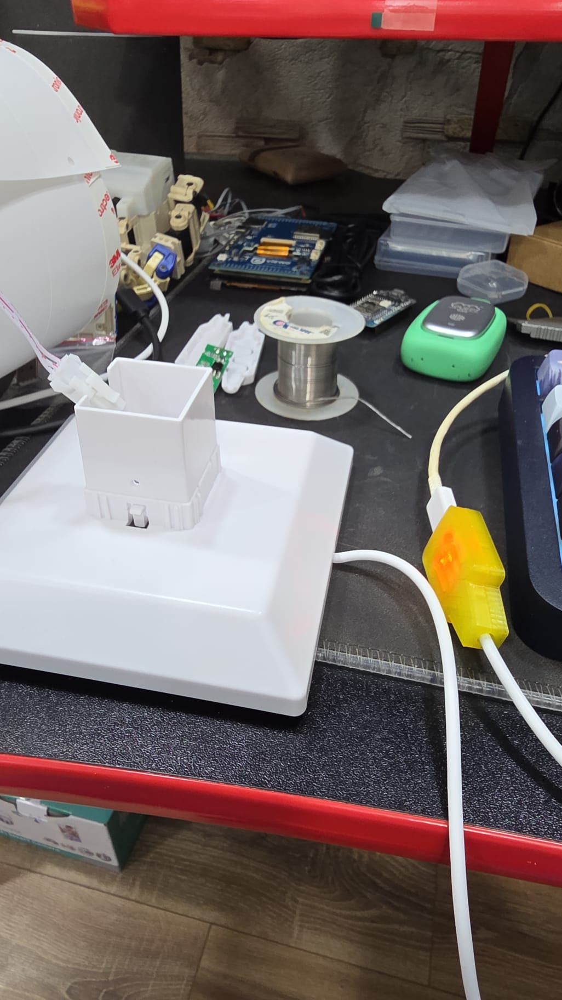

# ESP32 NeoPixel Stand 70 Pixel

PlatformIO firmware for a WEMOS LOLIN S3 Mini based NeoPixel stand controller with:

- ESP32-S3 Mini target using the ESP32-S3FH4R2 package
- 4 MB flash with OTA partitioning
- 2 MB PSRAM enabled and used for larger heap allocations
- local web UI derived from the ESP32 Notifier project interface
- Wi-Fi station mode plus fallback AP configuration mode
- MQTT command and state bridge
- GitHub Releases based OTA updates
- OLED status display support for SSD1306 and SH1106
- persisted settings in Preferences / NVS

## Hardware

Target board:

- WEMOS LOLIN S3 Mini
- ESP32-S3FH4R2
- 512 KB internal SRAM on-chip
- 4 MB flash
- 2 MB PSRAM

Default light-strip wiring:

| Function | GPIO | Notes |
|---|---:|---|
| NeoPixel data | 10 | Default built-in NeoPixel output on LOLIN S3 Mini |
| Status LED | 48 | On-board LED for status indication |
| Battery ADC | 4 | Optional external battery divider input |
| OLED SDA | 8 | Optional I2C OLED |
| OLED SCL | 9 | Optional I2C OLED |

Recommended strip wiring:

1. The default firmware target uses the LOLIN S3 Mini built-in NeoPixel on GPIO10.
2. For an external strip, connect the selected GPIO to the strip DIN through a 330 to 470 ohm series resistor.
3. Power the strip from a dedicated 5V supply sized for the LED count.
4. Tie ESP32 ground and LED power ground together.
5. Add a bulk capacitor across the strip power rails near the strip input.
6. For 70 pixels at full white, do not power the strip from the ESP32 board.

ESP32-S3 Mini pinout sketch:



## Project Photos

DIY Multicolor Floor Lamp modified to use the ESP32-S3 Mini board.

### Lamp Box



### Lamp Assembled View



### 3D Printed Controller Casing



## STL Files

STLs for printing are in `3D/STL`:

- `3D/STL/Neopixel_Stand_Controller_Bot.stl`
- `3D/STL/Neopixel_Stand_Controller_Top.stl`

Why GPIO10 by default:

- it matches the LOLIN S3 Mini built-in RGB LED wiring
- it allows the default build to work immediately on-board without external strip wiring
- you can still choose another saved GPIO from the Light tab for an external strip

## Defaults

This repository is configured for the GitHub project:

- owner: `elik745i`
- repository: `ESP32-Neopixel-Stand-70Pixels`
- default pixel count: `70`
- default NeoPixel data pin: `GPIO10`
- default OTA asset name: `esp32-neopixel-stand-70pixel-vX.Y.Z.bin`

## Features

The web UI keeps the notifier project shell and swaps the Audio tab for Light control.

Current light controls:

- power on or off
- brightness
- effect selection
- effect speed
- effect intensity
- power limiter in amps
- pixel count
- primary and secondary colors

Current infrastructure retained from the notifier baseline:

- Wi-Fi onboarding and AP fallback
- MQTT connectivity and Home Assistant oriented state topics
- GitHub release OTA update checks and installs
- OLED status screen
- saved settings in NVS

## PSRAM Optimization

This firmware explicitly enables PSRAM-aware behavior on boot:

- `BOARD_HAS_PSRAM` is defined in the S3 build profiles
- larger heap allocations are allowed to spill into external RAM via `heap_caps_malloc_extmem_enable(1024)`
- boot logs print detected total and free PSRAM

This keeps internal SRAM available for timing-sensitive runtime work while placing larger dynamic allocations into external memory when possible.

## OTA Update Flow

OTA checks are aligned to this repository's GitHub Releases.

The firmware queries:

- `https://api.github.com/repos/elik745i/ESP32-Neopixel-Stand-70Pixels/releases/latest`
- `https://api.github.com/repos/elik745i/ESP32-Neopixel-Stand-70Pixels/releases?per_page=10`

The default release asset template is:

- `esp32-neopixel-stand-70pixel-${version}.bin`

For version `v0.1.0`, the expected OTA asset is:

- `esp32-neopixel-stand-70pixel-v0.1.0.bin`

## Build

Build the default LOLIN S3 Mini target:

```powershell
pio run
```

Upload:

```powershell
pio run -t upload
```

Open monitor:

```powershell
pio device monitor -b 115200
```

## Release Process

Typical release flow for this repository:

1. Build with `pio run`.
2. Rename or copy `.pio/build/lolin_s3_mini_neopixel/firmware.bin` to `esp32-neopixel-stand-70pixel-vX.Y.Z.bin`.
3. Create a Git tag matching the firmware version, for example `v0.1.0`.
4. Publish a GitHub Release and upload that renamed `.bin` asset.
5. The device Firmware tab can then discover and install that release over OTA.

## Project Layout

- `platformio.ini`
- `include/default_config.h`
- `include/settings_schema.h`
- `include/version.h`
- `src/main.cpp`
- `src/audio_player.cpp`
- `src/settings_manager.cpp`
- `src/wifi_manager.cpp`
- `src/mqtt_manager.cpp`
- `src/ota_manager.cpp`
- `src/web_server.cpp`
- `src/display_manager.cpp`
- `web/index.html`
- `web/style.css`
- `web/app.js`

## Status

Current firmware version in this working tree:

- `v0.1.1`

Current default hardware profile in this working tree:

- `lolin_s3_mini_neopixel`
